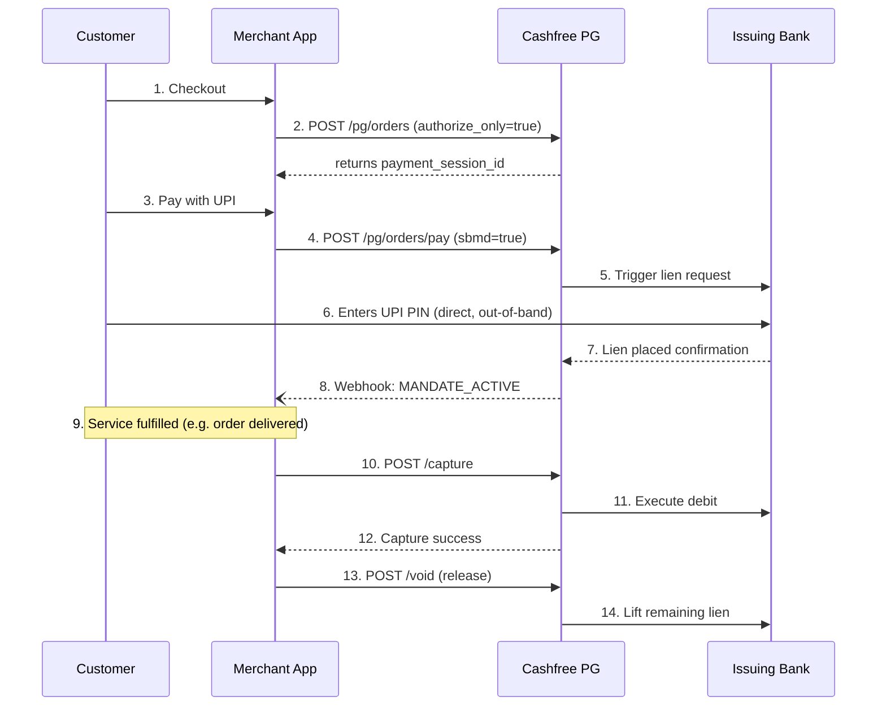

While standard UPI flows (Intent, Collect) transfer funds instantly, certain business models require a pre-authorization mechanism. Merchants often need to secure a customer's financial commitment upfront, but only capture the funds when a service is fulfilled, an order is adjusted, or a trade is executed.

UPI addresses this through **Mandate Block (Lien)** functionality. The customer pre-authorizes a transaction, freezing the required funds directly within their bank account. The money is only debited when the merchant initiates execution at a later time. This completely eliminates custodial risk, keeping money safely in the customer's account until the exact moment of payment.

## 1. Mandate Architecture Comparison

| Feature / Attribute | One-Time Mandates (OTM) | UPI AutoPay | SBMD / UPI Reserve Pay |
| :--- | :--- | :--- | :--- |
| **Mandate Recurrence** | One-Time | Recurring | Recurring |
| **Blocking of Funds (Lien)** | ✅ Yes | ❌ No | ✅ Yes |
| **Execution Pattern** | Single debit | Multiple debits per cycle | Multiple debits against 1 block |
| **Debit Failure Risk** | Near Zero (Funds Blocked) | High (Balance dependent) | Near Zero (Funds Blocked) |
| **Purpose Codes** | 01 | SI / Various | 76 (Trading), 77 (Retail) |
| **PIN Authentication** | 1-Time at Block creation | 1-Time at Setup | 1-Time at Block creation |

## 2. One-Time Mandates (OTM)

A One-Time Mandate allows a merchant to block funds for a single transaction and execute a single debit at a later time.

### Key Specifications

- **Purpose Code:** `01`
- **Primary Use Cases:** Hotel reservations, security deposits, IPO subscriptions (ASBA), e-commerce Pay-on-Delivery, and train ticket booking (IRCTC).
- **Execution:** A single debit up to the blocked amount (execution ≤ blocked amount). Once executed, the mandate is permanently closed, and any residual balance is automatically unblocked.
- **Mandate Creation:** Payee-initiated (Collect mode) or Payer-initiated (Intent/QR).
- **Mandate Operations:** `CREATE`, `MODIFY`, `REVOKE`.
- **Max Validity:** Configured by merchant/acquirer (up to 30 years maximum).

### Execution Rules & Mechanics

1. **Order Creation:** Call `POST /orders` with `authorize_only: true` and pass an authorization object detailing block amount and validity windows.
2. **Authorization:** Customer enters their UPI PIN via Intent, Collect, or Dynamic QR → issuing bank places a lien on the requested amount.
3. **Capture:** Merchant calls the **Pre-Authorization Capture API** with the final execution amount (≤ blocked amount). The bank debits the customer and settles the money to the merchant.
4. **Void/Release:** If an order is cancelled or unfulfilled, the merchant calls the **Void API**, immediately releasing the lien back to the customer.

> **TDR Pricing Rule:** Transaction Discount Rate (TDR) is charged upon mandate creation success. Even if a mandate is voided without capture, creation cost pricing applies.

## 3. Single Block Multiple Debits (SBMD) / UPI Reserve Pay

SBMD is an extension of OTM. It allows a merchant to block a maximum ceiling amount once and execute multiple partial debits against that single block over time — until the funds are exhausted, revoked, or expired.

Unlike traditional AutoPay, where individual recurring debits can fail due to low balance, SBMD guarantees that every debit execution is backed by pre-reserved funds.

### SBMD Purpose Codes & Vertical Specifications

#### Purpose Code 76 — Secondary Market Trading

Designed specifically for equity, derivative, and commodity broking under MCC 6211.

- **Flagship Use Case:** Investors block funds in their bank account against the Clearing Corporation (CC). As trades are executed by the broker throughout the day, the CC debits the block to settle trade obligations.
- **Maximum Transaction Limit:** Exceptional cap of ₹5,00,000 per block (aligned with RBI-approved ASBA limits).
- **Mandate Initiation:** Payer-Initiated strictly (Intent, QR, SDK). Collect mode is strictly prohibited.
- **Mandate Operations:** `CREATE` and `REVOKE` only. `MODIFY` is not permitted.
- **Revocable Flag:** Must be set to `N` (Non-revocable by customer inside TPAP apps). Revocation can only be triggered via merchant/CC interfaces.
- **Transaction Reference (`tr`) Format:** Must strictly follow the hyphen-separated structure:

  ```text
  TMCODE-SEGMENTCODE-UCCCODE-brokerref
  ```

  e.g., `12345-123-1122334456-brokerref`, where TM Code is 5 digits, Segment Code is 3 digits, and UCC is 12 digits.

- **Funding Sources:** Savings Accounts, Current Accounts, Overdraft Accounts.

#### Purpose Code 77 — Online Goods & Services

Designed for general e-commerce, quick commerce, travel, and mobility platforms.

- **Use Cases:** Quick commerce, online food delivery, travel bookings, cab aggregators, EV charging stations, in-app wallets (without preloading), and Pay-on-Delivery.
- **Maximum Transaction Limit:** Block capped at standard network limits of ₹10,00,000 (or standard ₹1,00,000 P2M depending on tier).
- **Block Validity:** Up to 90 days.
- **Mandate Initiation:** Payer-initiated (Intent, QR, SDK) or Payee-initiated (Collect mode permitted).
- **Mandate Operations:** `CREATE`, `MODIFY`, `REVOKE`. Modification is allowed strictly for the amount field.
- **Funding Sources:** Savings Accounts, Current Accounts, Overdrafts, RuPay Credit Cards on UPI, and Pre-Sanctioned Credit Lines.

#### Purpose Codes 78 & 79

Reserved by NPCI for upcoming product extensions and industry verticals.

### SBMD Use Case Deep Dives

| Vertical | Example |
| :--- | :--- |
| **Secondary Markets** | Investor blocks ₹5L against CC; broker debits per trade. |
| **Quick Commerce** | User blocks ₹2,000; mini-orders debit without PIN re-entry. |
| **Travel Bookings** | User blocks ₹10,000; flight, hotel, and cab debit as booked. |
| **In-App Wallets** | Funds stay in customer's bank; debited only on usage. |

## 4. Consumer Branding: UPI Reserve Pay

**UPI Reserve Pay** is NPCI's official consumer-facing brand name for SBMD. While technical specifications, APIs, and switch routing use "SBMD", customer-facing interfaces inside TPAP apps (Google Pay, PhonePe, Paytm, CRED) display "UPI Reserve Pay".

**In-App Messaging Example:** *"UPI Reserve Pay mandate — ₹10,000 blocked for [Merchant Name]"*

> **Merchant UX Best Practice:** Use "UPI Reserve Pay" in checkout banners and tooltips to build consumer familiarity with fund-blocking mechanics.

## 5. End-to-End Lifecycle & Architecture

The SBMD lifecycle operates across three distinct phases, separating authorization from physical fund transfer:

```text
[ Phase 1: Block ]  ---> Customer approves PIN ---> Bank liens funds ---> Mandate Active
[ Phase 2: Debit ]  ---> Merchant sends ReqPay  ---> Bank lifts lien ---> Debits exact amount
[ Phase 3: Release] ---> Expiry / Revoke API    ---> Bank drops lien ---> Unused balance freed
```

### Phase 1: Block (Mandate Creation)

1. Customer initiates mandate creation via Intent, QR, SDK, or Collect (Purpose Code 77 only).
2. The issuing bank prompts the user for their 4-digit or 6-digit UPI PIN.
3. Upon PIN validation, the issuing bank places a lien on the requested amount.
4. The switch returns confirmation back to the merchant.

**Sample Intent deep link structure for SBMD:**

```text
upi://mandate?ver=01&pn=MerchantName&cu=INR&amrule=MAX&block=Y
&purpose=77&mc=5552&mode=13&recur=ASPRESENTED&am=10000.00
&orgid=000000&rev=N&share=N&tn=Description&validitystart=27072026
&validityend=25102026&pa=merchant@bank&tr=REFERENCE123&txnType=CREATE
```

- `block=Y` — Triggers account lien.
- `recur=ASPRESENTED` — Configures multi-debit capability.
- `purpose=76 / 77` — Enforces industry-specific rules and ceilings.
- `amrule=MAX` — Declares amount as a maximum cap.

### Phase 2: Debit (Execution)

1. Merchant issues a `ReqPay` execution API call referencing the Unique Mandate Number (UMN) and required debit amount (≤ remaining lien).
2. The remitter bank verifies the digital signature attached to the mandate.
3. The bank temporarily lifts the lien, debits the exact requested execution amount, and re-applies the lien to any remaining unused balance:

   ```text
   Remaining Balance = Original Block − Σ(Successful Debits)
   ```

> **Mandatory Execution Rule:** Member banks are strictly prohibited from declining SBMD execution requests. All eligibility and status checks must be completed during initial mandate creation.

> **Timeout & Retries (Retail 77):** If an execution times out, it is treated as an immediate decline and reversed in real-time. Merchants can retry execution up to 3 times in 24 hours.

### Phase 3: Release (Unblock / Revoke)

Unutilized funds are released back to the customer's available balance under three conditions:

1. **Mandate Expiration:** Mandate validity period lapses (e.g., 90 days for retail).
2. **Explicit Revocation:** Merchant issues a `ReqMandate` (`type=REVOKE`) call.
3. **Exhaustion:** The blocked funds reach a zero balance through execution.

> **Revocation Rule:** Customers cannot directly revoke SBMD mandates inside their UPI apps. Revocation must be initiated by the merchant on behalf of the customer.

# Cashfree SBMD Pre-Authorization — Integration Guide

Cashfree Payments provides pre-authorization and SBMD (Single Block, Multiple Debit) capabilities through its Orders & Pre-Authorization APIs. This lets you place a lien on a customer's bank balance via UPI, then debit it in one or more partial captures as the order is fulfilled — releasing anything uncaptured back to the customer.

## Integration flow overview

Four parties are involved: the customer, your merchant app, Cashfree's payment gateway, and the customer's issuing bank.



## Step-by-step implementation

### Step 1 — Create a pre-authorization order

Call Cashfree's Create Order API with `authorize_only: true` in the order configuration.

**Endpoint:** `POST /pg/orders`

| Header | Value |
|---|---|
| `x-client-id` | `<YOUR_CASHFREE_APP_ID>` |
| `x-client-secret` | `<YOUR_CASHFREE_SECRET_KEY>` |
| `x-api-version` | `2023-08-01` (or latest) |

```json
{
  "order_id": "ORDER_SBMD_100293",
  "order_amount": 2000.00,
  "order_currency": "INR",
  "customer_details": {
    "customer_id": "CUST_88912",
    "customer_name": "Rahul Sharma",
    "customer_email": "rahul.sharma@example.com",
    "customer_phone": "9999999999"
  },
  "order_meta": {
    "return_url": "https://yourmerchant.com/order_status?order_id={order_id}",
    "notify_url": "https://yourmerchant.com/api/webhooks/cashfree"
  },
  "order_tags": {
    "flow": "SBMD_RESERVE_PAY"
  }
}
```

### Step 2 — Initiate payment (pay request with SBMD/OTM)

Invoke the Order Pay API with the UPI payment payload and the SBMD parameters (shown here for UPI intent / dynamic QR mode).

**Endpoint:** `POST /pg/orders/pay`

```json
{
  "payment_session_id": "session_g7a8F9d0K1...",
  "payment_method": {
    "upi": {
      "channel": "intent",
      "authorize_only": true,
      "sbmd": true,
      "purpose_code": "77",
      "mandate_details": {
        "max_amount": 2000.00,
        "start_date": "2026-07-29",
        "end_date": "2026-10-27"
      }
    }
  }
}
```

<details>
<summary><strong>Node.js SDK snippet</strong></summary>

```javascript
const { Cashfree } = require("cashfree-pg");

Cashfree.XClientId = "YOUR_APP_ID";
Cashfree.XClientSecret = "YOUR_SECRET_KEY";
Cashfree.XEnvironment = Cashfree.Environment.PRODUCTION;

async function createSBMDPayment(paymentSessionId) {
  try {
    const request = {
      payment_session_id: paymentSessionId,
      payment_method: {
        upi: {
          channel: "intent",
          authorize_only: true,
          sbmd: true,
          purpose_code: "77"
        }
      }
    };

    const response = await Cashfree.PGPay("2023-08-01", request);
    console.log("Pay Response:", response.data);
    // Redirect or trigger Intent flow on user device using response.data.data.payload
  } catch (error) {
    console.error("Error initiating SBMD payment:", error.response.data);
  }
}
```

</details>

### Step 3 — Capture / execute debit against blocked funds

Once the lien is active, execute single or multiple partial debits against the blocked funds until the total captured amount equals the original block amount.

**Endpoint:** `POST /pg/orders/{order_id}/authorization/capture`

```json
{
  "action": "CAPTURE",
  "amount": 450.00,
  "reference_id": "EXEC_CAPTURE_001",
  "remark": "Partial execution for mini-order #1"
}
```

<details>
<summary><strong>Python snippet</strong></summary>

```python
import requests

url = "https://api.cashfree.com/pg/orders/ORDER_SBMD_100293/authorization/capture"

headers = {
    "accept": "application/json",
    "content-type": "application/json",
    "x-api-version": "2023-08-01",
    "x-client-id": "YOUR_APP_ID",
    "x-client-secret": "YOUR_SECRET_KEY"
}

payload = {
    "action": "CAPTURE",
    "amount": 450.00,
    "reference_id": "EXEC_CAPTURE_001",
    "remark": "Partial debit execution"
}

response = requests.post(url, json=payload, headers=headers)
print("Capture Status Code:", response.status_code)
print("Response:", response.json())
```

</details>

### Step 4 — Void / release remaining blocked funds

When fulfillment is complete, or if the order is canceled, call the Void API to release the balance lien back to the customer instantly.

**Endpoint:** `POST /pg/orders/{order_id}/authorization/void`

```json
{
  "action": "VOID",
  "remark": "Order processing completed, unblocking remaining balance."
}
```

<details>
<summary><strong>cURL example</strong></summary>

```bash
curl --request POST \
  --url https://api.cashfree.com/pg/orders/ORDER_SBMD_100293/authorization/void \
  --header 'accept: application/json' \
  --header 'content-type: application/json' \
  --header 'x-api-version: 2023-08-01' \
  --header 'x-client-id: YOUR_APP_ID' \
  --header 'x-client-secret: YOUR_SECRET_KEY' \
  --data '
{
  "action": "VOID",
  "remark": "Releasing remaining lien amount to customer"
}
'
```

</details>

## Webhook events

Configure webhooks in your Cashfree Merchant Dashboard to handle asynchronous mandate updates.

| Event | Fired when |
|---|---|
| `MANDATE_CREATED` | The issuing bank successfully liens customer funds. |
| `CAPTURE_SUCCESS` | A partial or full debit against the lien succeeds. |
| `MANDATE_REVOKED` / `VOID_SUCCESS` | The lien is removed and remaining funds are freed. |

**Sample payload — `MANDATE_CREATED_NOTIFICATION`**

```json
{
  "type": "MANDATE_CREATED_NOTIFICATION",
  "raw_data": {
    "order_id": "ORDER_SBMD_100293",
    "umn": "123456789012@upi",
    "blocked_amount": 2000.00,
    "status": "SUCCESS",
    "purpose_code": "77"
  }
}
```

## Operational guardrails & best practices

> [!IMPORTANT]
> **MCC alignment** — Purpose Code 76 requires stockbroking MCC 6211. General retail e-commerce must use Purpose Code 77.

- **Refunds vs. voids** — You cannot use the Refund API on uncaptured money. Use the Void API to unblock locked funds, and reserve the Refund API for funds that have already been debited/captured.
- **OMS tracking** — Ensure your order management system can map multiple capture IDs against a single parent `order_id`.
- **TDR pricing** — Gateway TDR applies upon successful mandate creation (block), regardless of whether you capture the full amount or subsequently void the mandate.